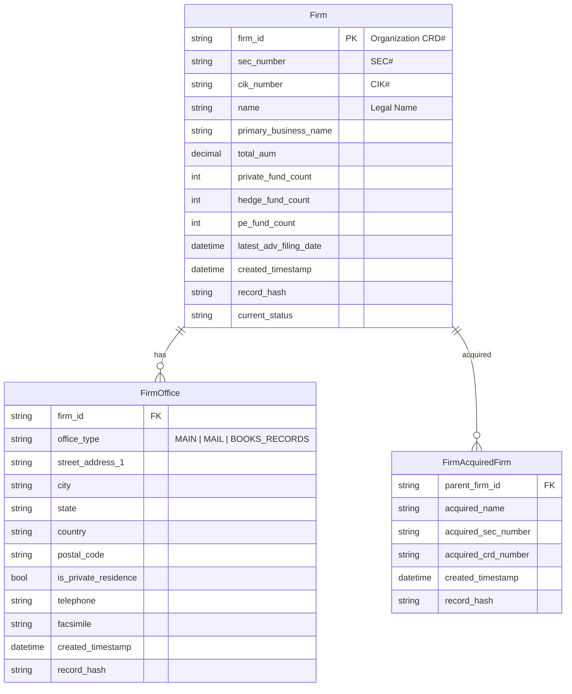

# SEC IA Firm Roster — Architecture & Design Documentation

## 1. Entity Relationship Diagram (ERD)

## 2. Canonical Data Dictionary

| Entity | Field | Type | Nullable | Description | Source Column |
|--------|-------|------|----------|-------------|---------------|
| **Firm** | firm_id | VARCHAR | N | Primary key (CRD#) | `Organization CRD#` |
| | sec_number | VARCHAR | Y | SEC registration number | `SEC#` |
| | cik_number | VARCHAR | Y | Central Index Key | `CIK#` |
| | name | VARCHAR | N | Legal entity name | `Legal Name` |
| | primary_business_name | VARCHAR | Y | DBA name | `Primary Business Name` |
| | total_aum | DECIMAL | Y | Total AUM (5.G.3) | `5.G.(3) - Total amount of Parallel Assets` |
| | discretionary_aum | DECIMAL | Y | Discretionary AUM | — |
| | non_discretionary_aum | DECIMAL | Y | Non-discretionary AUM | — |
| | other_regulatory_aum | DECIMAL | Y | Other regulatory AUM | — |
| | private_fund_count | INTEGER | Y | Count of private funds | `Count of Private Funds - 7B(1)` |
| | hedge_fund_count | INTEGER | Y | Hedge fund count | `Total number of Hedge funds` |
| | pe_fund_count | INTEGER | Y | PE fund count | `Total number of PE funds` |
| | real_estate_fund_count | INTEGER | Y | RE fund count | `Total number of Real Estate funds` |
| | vc_fund_count | INTEGER | Y | VC fund count | `Total number of VC funds` |
| | liquidity_fund_count | INTEGER | Y | Liquidity fund count | `Total number of Liquidity funds` |
| | latest_adv_filing_date | TIMESTAMP | Y | Most recent ADV filing | `Latest ADV Filing Date` |
| | record_hash | VARCHAR | N | SHA256 of source row | Generated |
| | dataset_version | VARCHAR | N | Source dataset tag (e.g. `ia07012026`) | Pipeline param |
| | created_timestamp | TIMESTAMP | N | Ingestion timestamp | Pipeline runtime |
| | current_status | VARCHAR | N | `active` | Hardcoded |

| **FirmOffice** | firm_id | VARCHAR | N | FK → Firm.firm_id | — |
| | office_type | ENUM | N | `MAIN`, `MAIL`, `BOOKS_RECORDS` | Derived from prefix |
| | street_address_1 | VARCHAR | Y | | `Main Office Street Address 1` |
| | street_address_2 | VARCHAR | Y | | `Main Office Street Address 2` |
| | city | VARCHAR | Y | | `Main Office City` |
| | state | VARCHAR | Y | | `Main Office State` |
| | country | VARCHAR | Y | | `Main Office Country` |
| | postal_code | VARCHAR | Y | | `Main Office Postal Code` |
| | is_private_residence | BOOLEAN | Y | | `Main Office Private Residence Flag` |
| | telephone | VARCHAR | Y | Main office only | `Main Office Telephone Number` |
| | facsimile | VARCHAR | Y | Main office only | `Main Office Facsimile Number` |

| **FirmAcquiredFirm** | parent_firm_id | VARCHAR | N | FK → Firm.firm_id | — |
| | acquired_name | VARCHAR | Y | | `Acquired Firm` |
| | acquired_sec_number | VARCHAR | Y | | `Acquired Firm SEC#` |
| | acquired_crd_number | VARCHAR | Y | | `Acquired Firm CRD#` |

## 3. Mapping Specification
Stored in `data/mapping_specification.json`. Maps source CSV columns → canonical fields. Single source of truth for column names.

## 4. Normalized DuckDB Schema
Tables created by `src/loader.py:write_silver()`:
- `silver_firms_<version>`
- `silver_firm_offices_<version>`
- `silver_firm_acquired_firms_<version>`

Schema derived from Pydantic model `model_dump()` output. Types:
- `Decimal` → `DOUBLE`
- `datetime` → `TIMESTAMP` (ISO string serialized)
- `Enum` → `VARCHAR`
- All others → native DuckDB types.

No explicit DDL; schema-on-write via `CREATE TABLE ... AS SELECT * FROM df`.

## 5. Repository Layer
`src/repository.py` — thin CRUD wrappers over DuckDB.
- `FirmRepository.save_firms()`, `get_by_id()`
- `OfficeRepository.save_offices()`, `get_by_firm()`
- `AcquiredFirmRepository.save_acquired_firms()`
- Uses pandas `DataFrame` bulk insert via `conn.register()`.

## 6. Validation Reports
Generated by `src/validator.py` → `data/quality/<dataset>/quality_report_<ts>.json`.
Contains:
- Row counts per entity
- Null percentages per column
- Type coercion failures
- Duplicate PK checks
- Business rule violations (e.g. negative AUM)

## 7. Normalization Pipeline
Orchestrated by `src/pipeline.py`:
1. **Extract** (`src/extract.py`): unzip → CSV → pandas DataFrame (bronze)
2. **Normalize** (`src/normalizer.py`): row-wise mapping + Pydantic validation → typed models
3. **Load** (`src/loader.py:write_silver`): bulk insert to DuckDB silver tables
4. **Validate** (`src/validator.py`): quality report
5. **Metadata** (`src/metadata.py`): manifest + lineage log

Bronze tables: `bronze_raw_<csv>_<version>` (raw strings, no coercion).

## 8. Design Decisions & Rationale

| Decision | Rationale | Ceiling / Upgrade Path |
|----------|-----------|------------------------|
| **Bronze/Silver only (no Gold)** | YAGNI — analytics queries run directly on silver. | Add Gold star schema when BI layer needs conformed dimensions. |
| **Pydantic for validation** | Runtime type coercion + clear error messages; no separate schema registry. | Swap to SQLMesh/dbt models if team standardizes on SQL-first. |
| **DuckDB as OLAP store** | Zero-config, embedded, columnar, Parquet-native. | Migrate to MotherDuck/Postgres/ClickHouse if multi-user or >100GB. |
| **SHA256 record_hash** | Idempotent upsert key; detects source changes. | Add CDC logic (hash diff) for incremental loads. |
| **Dataset version in table name** | Snapshot isolation; time-travel via `UNION ALL` across versions. | Partition by `dataset_version` column when table count grows. |
| **No ORM / raw SQL in repos** | Simplicity; DuckDB SQL is fast enough. | Add SQLAlchemy if dialect portability needed. |
| **Office types as Enum** | Closed set (3 values); prevents typos. | Promote to lookup table if SEC adds new office types. |
| **Money as Decimal** | Exact arithmetic for AUM. | None. |
| **Dates as `datetime` (not date)** | Source has `MM/DD/YYYY`; time component unused but harmless. | Cast to `DATE` in Gold layer. |
| **All fields nullable except PK/hash/status** | SEC FOIA data is sparse; coercion fails silently to `None`. | Add `NOT NULL` constraints in Gold after profiling completeness. |

## Operational Notes
- Run: `python -m src.pipeline --dataset ia07012026`
- Output: `data/silver/`, `data/quality/`, `data/metadata.db`
- Logs: `data/logs/pipeline.log`